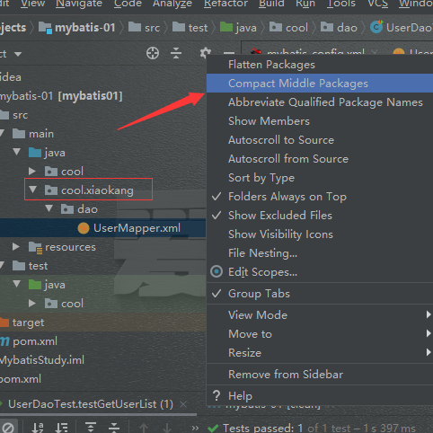
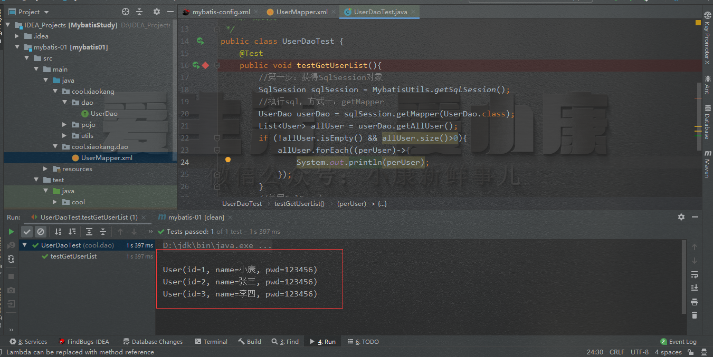
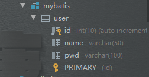
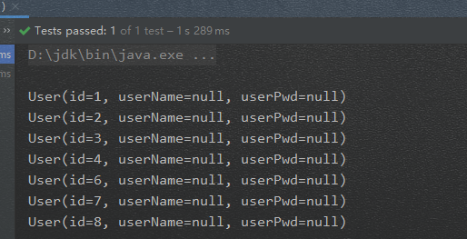
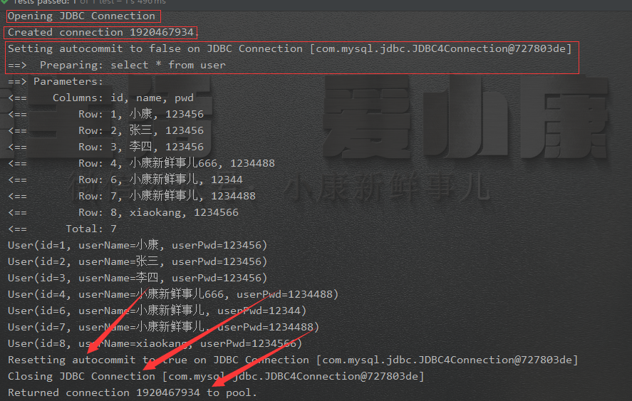
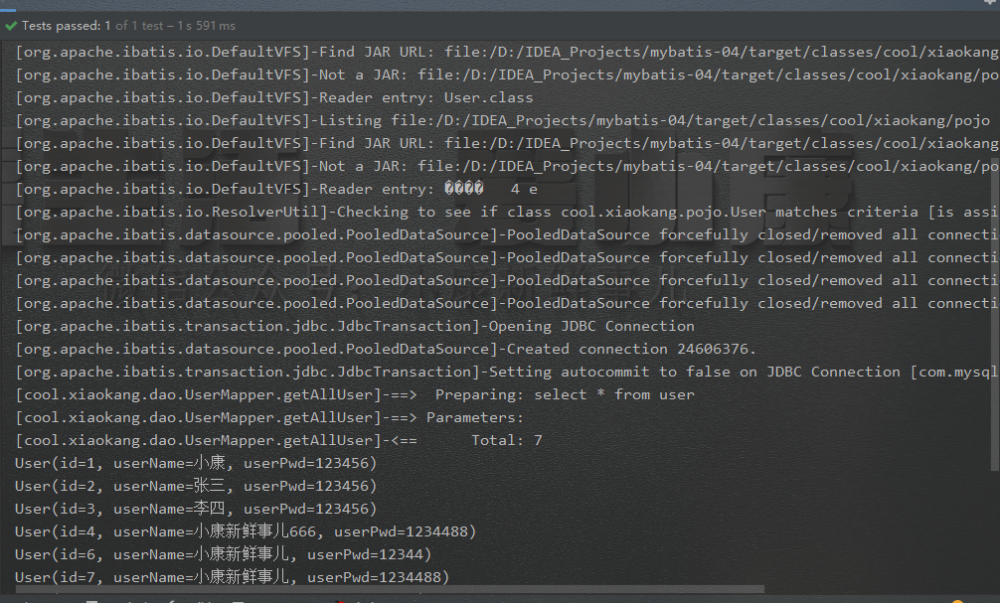
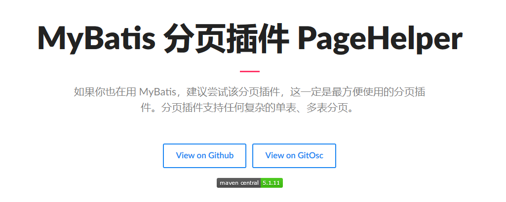

# Mybatis

## 1、 简介

### 1.1、什么是Mybatis

  

- MyBatis 是一款优秀的**持久层框架**
- 它支持定制化 SQL、存储过程以及高级映射
- MyBatis避免了几乎所有的 JDBC 代码和手动设置参数以及获取结果集
- MyBatis可以使用简单的 XML 或注解来配置和映射原生类型、接口和 Java 的 POJO（Plain Old Java Objects，普通老式 Java 对象）为数据库中的记录
-  MyBatis 本是[apache](https://baike.baidu.com/item/apache/6265)的一个开源项目[iBatis](https://baike.baidu.com/item/iBatis), 2010年这个项目由apache software foundation 迁移到了google code，并且改名为MyBatis 
- 2013年11月迁移到Github。 

如何获取Mybatis？

- maven仓库(直接最新版：10-20, 2019 )

  ```xml
  <!-- https://mvnrepository.com/artifact/org.mybatis/mybatis -->
  <dependency>
      <groupId>org.mybatis</groupId>
      <artifactId>mybatis</artifactId>
      <version>3.5.3</version>
  </dependency>
  ```

- GitHub：https://github.com/mybatis/mybatis-3/releases

- 中文文档：https://mybatis.org/mybatis-3/zh/index.html

### 1.2、持久化

数据持久化

- 持久化就是将程序中的数据在持久状态和瞬时状态（transient）转化的过程
- 内存：**断电即失**
- 数据库（JDBC技术）、IO文件持久化
- 生活中：冷藏

为什么需要持久化？

- 有一些对象不能丢失
- 内存价格太贵

### 1.3、持久层

Dao层、Service层、Controller层

- 完成持久化工作的代码块
- 层界限分明

### 1.4、为什么需要Mybatis

- 帮助程序员将数据存入数据库中
- 方便
- 传统的JDBC过于复杂和繁琐
- 不用Mybatis也可以，更容易上手，**技术没有高低之分**
- 优点
  - 简单易学
  - 灵活
  - 解除sql与程序代码的耦合，sql和代码的分离，提高了可维护性。
  - 提供映射标签，支持对象与数据库的orm字段关系映射
  - 提供对象关系映射标签，支持对象关系组建维护
  - 提供xml标签，支持编写动态sql

**最重要的一点就是：使用的人多、开发效率相对于操作传统的JDBC来说高得多**

## 2、第一个Mybatis程序

> 思路：搭建环境->导入Mybatis->编写代码->测试

### 2.1、搭建环境

搭建数据库

```sql
create database `mybatis`;
use `mybatis`;

create table `user`(
	`id` int(10) PRIMARY KEY NOT NULL AUTO_INCREMENT,
	`name` varchar(50) default null,
	`pwd` varchar(100) default null
)engine=innodb default charset=utf8;

insert into `user`(id,name,pwd) values(1,'小康','123456'),(2,'张三','123456'),(3,'李四','123456');
```

新建项目

1.新建一个普通的maven项目

2.删除src目录

3.导入maven依赖

```xml
<?xml version="1.0" encoding="UTF-8"?>
<project xmlns="http://maven.apache.org/POM/4.0.0"
         xmlns:xsi="http://www.w3.org/2001/XMLSchema-instance"
         xsi:schemaLocation="http://maven.apache.org/POM/4.0.0 http://maven.apache.org/xsd/maven-4.0.0.xsd">
    <modelVersion>4.0.0</modelVersion>

    <!-- 父工程 -->
    <groupId>cool.xiaokang</groupId>
    <artifactId>Mybatis-Study</artifactId>
    <version>1.0-SNAPSHOT</version>

    <!-- 导入依赖 -->
    <dependencies>
        <!-- mysql驱动 -->
        <dependency>
            <groupId>mysql</groupId>
            <artifactId>mysql-connector-java</artifactId>
            <version>5.1.48</version>
        </dependency>
        <!-- Mybatis -->
        <dependency>
            <groupId>org.mybatis</groupId>
            <artifactId>mybatis</artifactId>
            <version>3.5.3</version>
        </dependency>
        <!-- junit -->
        <dependency>
            <groupId>junit</groupId>
            <artifactId>junit</artifactId>
            <version>4.12</version>
        </dependency>
    </dependencies>
</project>
```

### 2.2、创建一个模块

- 编写Mybatis的核心配置文件

  ```xml
  <?xml version="1.0" encoding="UTF-8" ?>
  <!DOCTYPE configuration
          PUBLIC "-//mybatis.org//DTD Config 3.0//EN"
          "http://mybatis.org/dtd/mybatis-3-config.dtd">
  <configuration>
      <environments default="development">
          <environment id="development">
              <transactionManager type="JDBC"/>
              <dataSource type="POOLED">
                  <property name="driver" value="com.mysql.jdbc.Driver"/>
                  <property name="url" value="jdbc:mysql://localhost:3306/mybatis?useUnicode=true&amp;useSSL=false&amp;characterEncoding=UTF-8"/>
                  <property name="username" value="root"/>
                  <property name="password" value="xiaokang"/>
              </dataSource>
          </environment>
      </environments>
  </configuration>
  ```

- 编写Mybatis工具类

```java
package cool.xiaokang.util;

import org.apache.ibatis.io.Resources;
import org.apache.ibatis.session.SqlSession;
import org.apache.ibatis.session.SqlSessionFactory;
import org.apache.ibatis.session.SqlSessionFactoryBuilder;

import java.io.IOException;
import java.io.InputStream;

/**
 * sqlSessionFactory工具类（单例模式）
 *
 * @author xiaokang
 */
public class MybatisUtils {
    private static SqlSessionFactory sqlSessionFactory;
    private static InputStream is;

    static {
        try {
            is = Resources.getResourceAsStream("mybatis-config.xml");
        } catch (IOException e) {
            e.printStackTrace();
        }
    }

    /**
     * 获取SqlSessionFactory对象
     * @return SqlSessionFactory
     */
    public static SqlSessionFactory getSqlSessionFactory() {
        if (sqlSessionFactory == null) {
            sqlSessionFactory = new SqlSessionFactoryBuilder().build(is);
        }
        return sqlSessionFactory;
    }

    /**
     * 通过SqlSessionFactory获取SqlSession实例
     * @return SqlSession
     */
    public static SqlSession getSqlSession() {
        return getSqlSessionFactory().openSession();
    }
}
```

### 2.3、编写代码

- 实体类

  这里引入Lombok插件（代码更优雅）

  ```xml
  <!--lombok-->
  <dependency>
      <groupId>org.projectlombok</groupId>
      <artifactId>lombok</artifactId>
      <version>1.18.8</version>
      <scope>provided</scope>
  </dependency>
  ```

  ```java
  package cool.xiaokang.pojo;
  
  import lombok.AllArgsConstructor;
  import lombok.Data;
  import lombok.NoArgsConstructor;
  
  /**
   * 用户实体类
   * @author 小康
   */
  @Data
  @NoArgsConstructor
  @AllArgsConstructor
  public class User {
      private Integer id;
      private String name,pwd;
  
      public User(String name, String pwd) {
          this.name = name;
          this.pwd = pwd;
      }
  }
  ```

- Dao层接口

  ```java
  package cool.xiaokang.dao;
  
  import cool.xiaokang.pojo.User;
  
  import java.util.List;
  
  /**
   * 用户Dao层接口
   * @author 小康
   */
  public interface UserDao {
      /**
       * 获取所有用户记录
       * @return List<User>
       */
      List<User> getAllUser();
  }
  ```

- 接口实现类由原来的UserDaoImpl转为一个UserMapper配置文件

  ```xml
  <?xml version="1.0" encoding="UTF-8" ?>
  <!DOCTYPE mapper
          PUBLIC "-//mybatis.org//DTD Mapper 3.0//EN"
          "http://mybatis.org/dtd/mybatis-3-mapper.dtd">
  <!-- namespace绑定一个Dao接口 -->
  <mapper namespace="cool.xiaokang.dao.UserDao">
      <select id="getAllUser" resultType="cool.xiaokang.pojo.User">
          select  * from user
      </select>
  </mapper>
  ```

### 2.4、测试

- junit测试

 遇到以下错误

父工程的pom.xml中添加如下代码

```xml
<properties>
        <project.build.sourceEncoding>UTF-8</project.build.sourceEncoding>
</properties>
```


UserMapper.xml中添加如下代码

```xml
<mappers>
        <!-- 每一个Mapper.xml都要在这个mybatis-config.xml核心配置文件中注册 -->
        <mapper resource="cool/xiaokang/dao/UserMapper.xml"/>
</mappers>
```

maven由于它的约定大于配置，就会出现如下配置文件无法被导出或生效的问题


解决方法如下，为了保证万无一失，父工程和子工程的pom.xml中都加入如下代码

```xml
<!-- 在build中配置resources，来防止资源导出失败的问题 -->
<build>
	<resources>
    	<resource>
        	<directory>src/main/resources</directory>
            <includes>
                <include>**/*.properties</include>
            	<include>**/*.xml</include>
            </includes>
            <filtering>true</filtering>
        </resource>
        <resource>
        	<directory>src/main/java</directory>
            <includes>
                <include>**/*.properties</include>
            	<include>**/*.xml</include>
            </includes>
            <filtering>true</filtering>
        </resource>
    </resources>
</build>
```

将此处的对勾去掉，创建包的时候就不会是点隔开的了，而是分级展开



```java
package cool.xiaokang.dao;

import cool.xiaokang.pojo.User;
import cool.xiaokang.utils.MybatisUtils;
import org.apache.ibatis.session.SqlSession;
import org.junit.Test;

import java.util.List;

/**
 * 用户测试类
 */
public class UserDaoTest {
    @Test
    public void testGetUserList(){
        //第一步：获得SqlSession对象
        SqlSession sqlSession = MybatisUtils.getSqlSession();
        //执行sql，方式一：getMapper
        UserDao userDao = sqlSession.getMapper(UserDao.class);
        List<User> allUser = userDao.getAllUser();
        if (!allUser.isEmpty() && allUser.size()>0){
            allUser.forEach((perUser)->{
                System.out.println(perUser);
            });
        }
        //关闭SqlSession
        sqlSession.close();
    }
}
```



## 3、CRUD

### 1、namespace

namespace中的包名要和Dao/Mapper接口的包名一致

### 2、select

查询：

- id：对应的namespace中的方法名
- resultType：sql语句执行的返回值
- parameterType：参数类型

1. 编写接口

   ```java
    	/**
        * 通过id查找用户
        * @param id
        * @return User
        */
       User findUserById(Integer id);
   ```

2. 编写对应的Mapper中的sql语句

   ```xml
   <select id="findUserById" parameterType="Integer" resultType="cool.xiaokang.pojo.User">
           select * from user where id=#{id}
   </select>
   ```

3. 测试

```java
	@Test
    public void testfindUserById(){
        //第一步：获得SqlSession对象
        SqlSession sqlSession = MybatisUtils.getSqlSession();
        //执行sql，方式一：getMapper
        UserDao userDao = sqlSession.getMapper(UserDao.class);
        User userById = userDao.findUserById(1);
        List<User> allUser = userDao.getAllUser();
        if (userById!=null){
            System.out.println(userById);
        }

        //关闭SqlSession
        sqlSession.close();
    }
```

### 3、insert

```xml
<insert id="addUser" parameterType="cool.xiaokang.pojo.User">
        insert into user values(null,#{name},#{pwd})
</insert>
```

### 4、update

```xml
<update id="updateUser" parameterType="cool.xiaokang.pojo.User">
        update user set name=#{name},pwd=#{pwd} where id=#{id}
</update>
```

### 5、delete

```xml
<delete id="deleteUser" parameterType="Integer">
        delete from user where id=#{id}
</delete>
```

### 6、分析错误

- 标签不要匹配错误
- resource绑定mapper，需要使用路径
- 程序配置文件必须符合规范
- NullPointerExceptionn，没有注册到资源
- 输出的xml文件中存在中文乱码问题
- maven资源没有导出问题

### 7、万能Map

假如我们的实体类、数据库的表或者参数过多，就应当考虑使用Map

```java
	/**
     * 添加一个用户（Map方式）
     * @param map
     * @return int
     */
    int addUser1(Map<String,Object> map);
```

```xml
<insert id="addUser1" parameterType="Map">
        insert into user values(null,#{user_name},#{user_pwd})
</insert>
```

Map传递参数，直接在sql中取出key即可【parameterType="Map"】

对象传递参数，直接在sql中取出对象的属性即可【parameterType="cool.xiaokang.pojo.User"】

只有一个基本类型的参数的时候，可以直接在sql中取到

多个参数用Map或者注解

### 8、模糊查询

1. Java代码执行的时候，传递通配符%%

   ```java
   List<User> allUser = userDao.getUserLike("%小康%");
   ```

2. 在sql拼接中使用通配符（开发不会用这种的哦）

```xml
<select id="getUserLike" parameterType="String" resultType="cool.xiaokang.pojo.User">
        select * from user where name like "%"#{name}"%"
</select>
```

## 4、配置解析

### 1、核心配置文件

- mybatis-config.xml(这个名字可以随意取，只不过官方推荐这个而已，约定俗成嘛)

-  MyBatis 的配置文件包含了会深深影响 MyBatis 行为的设置和属性信息。 

  ```properties
  configuration（配置）
      properties（属性）---掌握
      settings（设置）---掌握
      typeAliases（类型别名）---必须掌握
      typeHandlers（类型处理器）---了解
      objectFactory（对象工厂）---了解
      plugins（插件）---了解
      environments（环境配置）---掌握
          environment（环境变量）
              transactionManager（事务管理器）
              dataSource（数据源）
      databaseIdProvider（数据库厂商标识）---了解
      mappers（映射器）---掌握
  
  ```

### 2、环境配置（environments）

 MyBatis 可以配置成适应多种环境 

 **不过要记住：尽管可以配置多个环境，但每个 SqlSessionFactory实例只能选择一种环境。** 

Mybatis默认的事务管理器是JDBC，连接池是POOLED

### 3、属性（properties）

我们可以通过properties属性来实现引用配置文件

 这些属性都是可外部配置且可动态替换的，既可以在典型的 Java 属性文件中配置，亦可通过 properties 元素的子元素来传递。 【db.properties】

编写db.properties配置文件

```properties
driver=com.mysql.jdbc.Driver
url=jdbc:mysql://localhost:3306/mybatis?useUnicode=true&amp;useSSL=false&amp;characterEncoding=UTF-8
username=root
password=xiaokang
```

在核心配置文件中引入

- 可以直接引入外部文件
- 引入外部文件的同时也可以在其中增加一些属性
- 如果尾部文件和<properties>中的字段相同，优先使用外部文件的配置

### 4、类型别名（typeAliases）

-  类型别名是为 Java 类型设置一个短的名字 

-  存在的意义仅在于用来减少类完全限定名的冗余

  ```xml
  <typeAliases>
          <!-- 给指定实体类起一个别名 -->
          <typeAlias type="cool.xiaokang.pojo.User" alias="User"/>
  </typeAliases>
  ```

- 也可以指定一个包名，MyBatis 会在包名下面搜索需要的 Java Bean 

   在没有注解的情况下，会使用Bean 的首字母小写的非限定类名来作为它的别名。 

   **比如 `domain.blog.Author` 的别名为author；若有注解，则别名为其注解值。** 

  小编实际测试（大小写随意搭配都可以！！！但还是**建议和实体类名一致即可**）	

```xml
<typeAliases>
        <!-- 给指定包下所有实体类起一个别名，默认别名为实体类首字母小写 -->
        <package name="cool.xiaokang.pojo"/>
</typeAliases>
```

实体类较少的情况下使用单独取别名方式，实体类较多的情况下使用扫描包方式（**后者开发中必备**）

第一种方式别名可以DIY，第二种方式则不可以，若强行需要DIY的话可以在实体类使用@Alias注解实现

```java
@Alias("User")
public class User {}
```

### 5、设置（settings）

 这是 MyBatis 中极为重要的调整设置，它们会改变 MyBatis 的运行时行为。 


### 6、其它配置

typeHandlers（类型处理器）

objectFactory（对象工厂）

plugins(插件)

- mybatis-generator-core
- mybatis-plus
- 通用mappers

### 7、映射器（mappers）

MapperRegistry:注册绑定我们的Mapper文件

方式一：使用相对于类路径的资源引用 

```xml
<mappers>
        <mapper resource="cool/xiaokang/dao/UserMapper.xml"/>
</mappers>
```

方式二：使用映射器接口实现类的完全限定类名

```xml
<mappers>
        <mapper class="cool.xiaokang.dao.UserMapper"/>
</mappers>
```

注意点

- 接口和它的Mapper配置文件必须在同一个包下
- 接口和它的Mapper配置文件必须同名

方式三：将包内的映射器接口实现全部注册为映射器

```xml
<mappers>
        <package name="cool.xiaokang.dao"/>
</mappers>
```

注意点

- 接口和它的Mapper配置文件必须在同一个包下
- 接口和它的Mapper配置文件必须同名

### 8、生命周期和作用域

 作用域和生命周期类是至关重要的，因为错误的使用会导致非常严重的**并发问题**。 

#### SqlSessionFactoryBuilder

-  一旦创建了 SqlSessionFactory，就不再需要它了 
-   最佳作用域是**方法作用域**（也就是局部方法变量） 

#### SqlSessionFactory

- 可以理解为我们所了解的数据库连接池

-  SqlSessionFactory 一旦被创建就应该在应用的运行期间一直存在，**没有任何理由丢弃它或重新创建另一个实例**。 
-  最佳实践是在应用**运行期间**不要重复创建多次，多次重建SqlSessionFactory 被视为一种代码“坏味道（bad smell）” 
-  最简单的就是使用单例模式或者静态单例模式 

#### SqlSession

- 可以理解为连接到连接池的一个请求
-  SqlSession          的实例不是线程安全的，因此是不能被共享的，所以它的最佳的作用域是请求或方法作用域。
- 用完之后需要赶紧关闭，否则占用资源

**这里面每一个Mapper就代表一个具体的业务！**

## 5、解决属性名和字段名不一致的问题

数据库中字段如下



测试实体类字段不一致的情况

```java
package cool.xiaokang.pojo;

import lombok.AllArgsConstructor;
import lombok.Data;
import lombok.NoArgsConstructor;
import org.apache.ibatis.type.Alias;

/**
 * 用户实体类
 * @author 小康
 */
@Data
@NoArgsConstructor
@AllArgsConstructor
@Alias("User")
public class User {
    private Integer id;
    private String userName,userPwd;

    public User(String name, String pwd) {
        this.userName = name;
        this.userPwd = pwd;
    }
}
```

测试出现如下问题



```xml
select * from user
//类型处理器
select id,name,pwd from user
```

解决方法

- 修改sql语句---起别名

  ```xml
  <select id="getAllUser" resultType="User">
          select id,name userName,pwd userPwd from user
  </select>
  ```

- resultMap

  结果集映射

  ```properties
  id name pwd//数据库中字段名
  id userName userPwd//实体类中属性名
  ```

  ```xml
   <!-- 结果集映射 -->
      <resultMap id="UserResult" type="User">
          <!-- 这里property对应实体类中的属性名，column对应数据库的字段 -->
          <result property="id" column="id"/>
          <result property="userName" column="name"/>
          <result property="userPwd" column="pwd"/>
      </resultMap>
  ```

-  `resultMap` 元素是 MyBatis 中最重要最强大的元素
-  ResultMap的设计思想是，对于简单的语句根本不需要配置显式的结果映射，而对于复杂一点的语句只需要描述它们的关系就行了
-  `ResultMap` 最优秀的地方在于，虽然你已经对它相当了解了，但是根本就不需要显式地用到他们
-  **如果世界总是这么简单就好了** 

## 6、日志

### 1、日志工厂

如果一个数据库操作出现了异常，我们需要排错，日志就是最好的助手！

曾经：syso、debug

now:日志工厂！！！


- SLF4J 
- LOG4J 【掌握】
- LOG4J2
- JDK_LOGGING 
- COMMONS_LOGGING 
- STDOUT_LOGGING 【掌握】
- NO_LOGGING               

在mybatis中具体使用哪个日志实现，需要在设置中指定！！！

STDOUT_LOGGING标准日志输出

在核心配置文件中配置如下

```xml
<settings>
        <setting name="logImpl" value="STDOUT_LOGGING"/>
</settings>
```



### 2、Log4J

什么是Log4J？

- Log4j是[Apache](https://baike.baidu.com/item/Apache/8512995)的一个开源项目，通过使用Log4j，我们可以控制日志信息输送的目的地是[控制台](https://baike.baidu.com/item/控制台/2438626)、文件、[GUI](https://baike.baidu.com/item/GUI)组件，甚至是套接口服务器、[NT](https://baike.baidu.com/item/NT/3443842)的事件记录器、[UNIX](https://baike.baidu.com/item/UNIX) [Syslog](https://baike.baidu.com/item/Syslog)[守护进程](https://baike.baidu.com/item/守护进程/966835)等
-  我们也可以控制每一条日志的输出格式 
-  通过定义每一条日志信息的级别，我们能够更加细致地控制日志的生成过程 
-  可以通过一个[配置文件](https://baike.baidu.com/item/配置文件/286550)来灵活地进行配置，而不需要修改应用的代码 

1. 导入log4j的jar包

   ```xml
   <!-- https://mvnrepository.com/artifact/log4j/log4j -->
   <dependency>
       <groupId>log4j</groupId>
       <artifactId>log4j</artifactId>
       <version>1.2.17</version>
   </dependency>
   ```

2. log4j.properties

   ```properties
   #将等级为DEBUG的日志信息输出到console和file这两个目的地
   log4j.rootLogger=DEBUG,console,file
   
   #控制台输出的相关设置
   log4j.appender.console=org.apache.log4j.ConsoleAppender
   log4j.appender.console.Target=System.out
   log4j.appender.console.Threshold=DEBUG
   log4j.appender.console.layout=org.apache.log4j.PatternLayout
   log4j.appender.console.layout.ConversionPattern=[%c]-%m%n
   
   #文件输出的相关设置
   log4j.appender.file=org.apache.log4j.RollingFileAppender
   log4j.appender.file.File=D:\\mybatis-04.log
   log4j.appender.file.MaxFileSize=10mb
   log4j.appender.file.Threshold=DEBUG
   log4j.appender.file.layout=org.apache.log4j.PatternLayout
   log4j.appender.file.layout.ConversionPattern=[%p][%d{yyyy-MM-dd}][%c]%m%n
   
   
   #日志输出级别
   log4j.logger.org.mybatis=DEBUG
   log4j.logger.java.sql=DEBUG
   log4j.logger.java.sql.Statement=DEBUG
   log4j.logger.java.sql.ResultSet=DEBUG
   log4j.logger.java.sql.PreparedStatement=DEBUG
   ```

3. 配置log4j为日志的具体实现

   ```xml
   <settings>
           <setting name="logImpl" value="LOG4J"></setting>
   </settings>
   ```

4. 直接测试运行刚才的查询操作

   

## 7、分页

目的：减少数据的处理量

- 使用limit分页

```xml
语法：select * from user limit start,size
select * from user limit 3 相当于select * from user limit 0,3
```

- 使用Mybatis分页

  1. 接口

     ```java
     	/**
          * 分页获取用户记录
          * @param map
          * @return List<User>
          */
         List<User> getUserByLimit(Map<String,Integer> map);
     ```

  2. Mapper.xml

     ```xml
     <select id="getUserByLimit" parameterType="Map" resultMap="UserResult">
             select * from user limit #{start},#{size}
     </select>
     ```

  3. 测试

     ```java
     	@Test
         public void testGetUserByLimit() {
             //第一步：获得SqlSession对象
             SqlSession sqlSession = MybatisUtils.getSqlSession();
             //执行sql，方式一：getMapper
             UserMapper userMapper = sqlSession.getMapper(UserMapper.class);
             Map<String,Integer> map=new HashMap<String,Integer>(0);
             map.put("start",3);
             map.put("size",2);
             List<User> allUser = userMapper.getUserByLimit(map);
             if (!allUserU.isEmpty() && allUser.size() > 0) {
                 allUser.forEach((perUser) -> {
                     System.out.println(perUser);
                 });
             }
             //关闭SqlSession
             sqlSession.close();
         }
     ```

- RowBounds分页（开发基本不用，了解即可）

  1. 接口

     ```java
     	/**
          * RowBounds分页获取用户记录
          * @param rowBounds
          * @return List<User>
          */
         List<User> getUserByRowBounds(RowBounds rowBounds);
     ```

  2. Mapper.xml

     ```xml
     <select id="getUserByRowBounds" resultMap="UserResult">
             select * from user
     </select>
     ```

  3. 测试

     ```java
     	@Test
         public void testGetUserByRowBounds() {
             //第一步：获得SqlSession对象
             SqlSession sqlSession = MybatisUtils.getSqlSession();
             //执行sql，方式一：getMapper
             UserMapper userMapper = sqlSession.getMapper(UserMapper.class);
             RowBounds rowBounds = new RowBounds(3,2);
             List<User> allUser = userMapper.getUserByRowBounds(rowBounds);
             if (!allUser.isEmpty() && allUser.size() > 0) {
                 allUser.forEach((perUser) -> {
                     System.out.println(perUser);
                 });
             }
     
             //关闭SqlSession
             sqlSession.close();
         }
     ```

- 分页插件PageHelper



了解即可，用的时候查文档即可：https://pagehelper.github.io/docs/howtouse/

## 8、使用注解开发

1. 注解在接口上实现

   ```java
   	/**
        * 获取所有用户记录
        * @return List<User>
        */
       @Select("select * from user")
       List<User> getAllUser();
   ```

2. 需要在核心配置文件中绑定接口

   ```xml
   <mappers>
           <mapper class="cool.xiaokang.dao.UserMapper"/>
   </mappers>
   ```

3. 测试

   ```java
   	@Test
       public void testGetUserList() {
           //第一步：获得SqlSession对象
           SqlSession sqlSession = MybatisUtils.getSqlSession();
           //执行sql，方式一：getMapper
           UserMapper userMapper = sqlSession.getMapper(UserMapper.class);
           List<User> allUser = userMapper.getAllUser();
           if (!allUser.isEmpty() && allUser.size() > 0) {
               allUser.forEach((perUser) -> {
                   System.out.println(perUser);
               });
           }
   
           //关闭SqlSession
           sqlSession.close();
       }
   ```

**本质：反射机制，底层：动态代理**