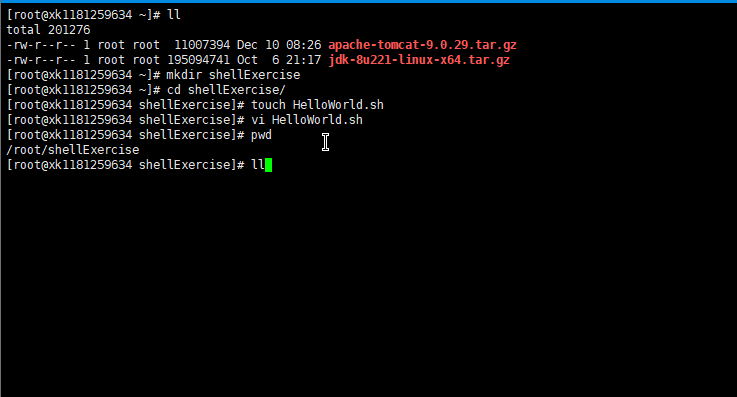
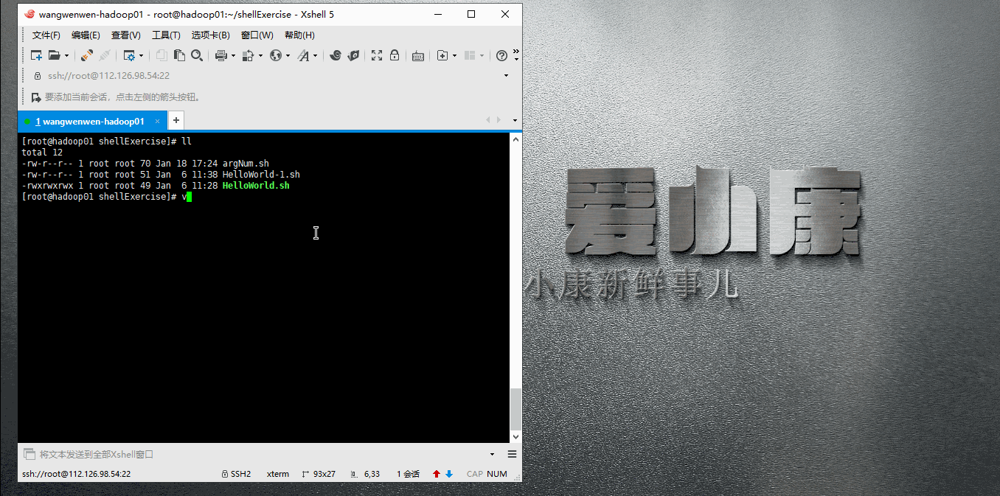

# Shell

## 1.概述

Shell是一个命令行解释器，它为用户提供了一个向Linux内核发送请求以便运行程序的界面系统级程序，用户可以用Shell来启动、挂起、停止甚至是编写一些程序。

Shell还是一个功能相当强大的编程语言，易编写、易调试、灵活性强。Shell是解释执行的脚本语言，在Shell中可以调用Linux系统命令。

## 2.Shell脚本的执行方式

- 脚本格式

  1. 脚本以**#!/bin/bash**开头
  2. 脚本必须有可执行权限

- 第一个Shell脚本

  1. 需求：创建一个Shell脚本，输出**HelloWorld-小康新鲜事儿！**

  2. 实际操作：

     

- 脚本的常用执行方式

  - 第一种：输入脚本的绝对路径或相对路径

    1. 首先赋予HelloWorld.sh脚本的+x权限

       ```bash
       chmod 777 HelloWorld.sh
       ```

    2. 执行脚本

       ```bash
       /root/shellExercise/HelloWorld.sh
       ./HelloWorld.sh
       ```

    

  - 第二种：bash或sh+脚本（不用赋予脚本+x权限）

    ```bash
    sh /root/shellExercise/HelloWorld-1.sh
    sh HelloWorld-1.sh
    ```

    

## 3.Shell中的变量

1. LinuxShell中的变量分为系统变量和用户自定义变量
2. 系统变量：$HOME、$PWD、$SHELL、$USER等等
3. 显示当前Shell中所有变量：set

### 1.定义变量

- 基本语法

  定义变量：变量=值( 变量名和等号之间不能有空格,变量后面不能有; )

  撤销变量：unset 变量

  声明静态变量：readonly 变量，注意：**这里不能unset**

- 变量定义规则

  变量名称可以由字母、数字和下划线组成，但是不能以数字开头

  等号两侧**不能有空格**

  变量名称区分大小写，一般**习惯大写**

- 实操

  ```bash
  #定义变量A
  A=8
  #撤销变量A
  unset A
  #声明静态的变量B=2，不能unset
  readonly B=2
  #可把变量提升为全局环境变量，可供其它Shell程序使用
  export 变量名
  ```


### 2.将命令的返回值赋给变量

```bash
#反引号，运行里面的命令，并把结果返回给变量A
A=`ls -lhA`
#下面这种写法等价于上面
A=$(ls -lhA)
```


### 3.设置环境变量

基本语法

export 变量名=变量值（将Shell变量输出为环境变量）

source 配置文件（让修改后的配置信息立即生效）

echo $变量名 （查询环境变量的值）

### 4.位置参数变量

基本语法

$n （n为数字，$0代表命令本身，$1-$9代表第一到第九个参数，十以上的参数，十以上的参数需要用大括号包含，如${10}）

$* （这个变量代表命令行中所有的参数，$*把所有的参数看成一个整体）

$@ （这个变量也代表命令行中所有的参数，不过$@把每个参数区分对待）

$# （这个变量代表命令行中所有参数的个数）


$*与$@的区别

- $*与$@都表示传递给函数或脚本的所有参数，不被双引号""包含时，都以$1 $2 ... $n的形式输出所有参数
- 当它们被双引号""包含时，“$*”会将所有的参数作为一个整体，以“$1 $2 ... $n”的形式输出所有参数；“$@”会将各个参数分开，以”$1" "$2" ... "$n“的形式输出所有参数

### 5.预定义变量

基本语法

$?（最后一次执行的命令的返回状态。如果这个变量的值为0，证明上一个命令正确执行；如果这个变量的值为非0（具体是哪个数，由命令自己来决定），则证明上一个命令执行不正确）

$$ （当前进程的进程号（PID））

$! （后台运行的最后一个进程的进程号（PID））



## 4.运算符

基本语法

1. ”$((运算式))“或”$[运算式]“
2. expr m+n
3. expr \*,/,%


**Tips**（expr注意事项）

-  运算符号和参数之间要有空格分开 
-  通配符号（*）,在作为乘法运算符时要用\ 
-  ’ ‘可以改变运算顺序，表示先计算’ '里面的内容，相当于算术运算中的括号 

## 5.条件判断

### 1.判断语句

- 基本语法

  ```bash
  [ condition ]（注意：condition前后要有空格）
  #非空返回true，可使用$?验证（0为true，>1为false）
  ```

- 案例实操


## 6.流程控制


## 7.read读取控制台输入


## 8.函数

